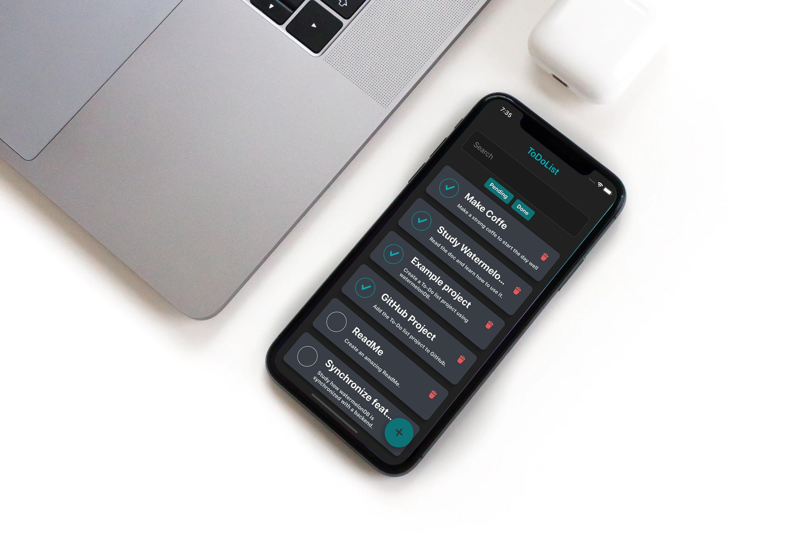
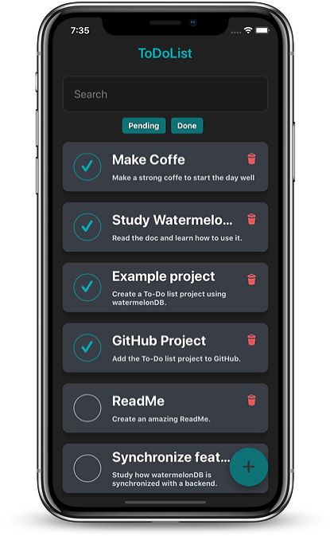
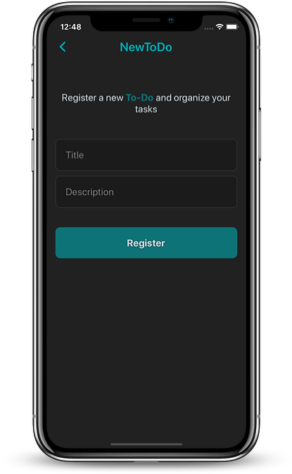

[](https://github.com/fhugoduarte/OfflineToDoList/stargazers)
[](https://github.com/fhugoduarte/OfflineToDoList/issues)
[](https://github.com/fhugoduarte/OfflineToDoList/network)

<br />
<p align="center">
  


  <h2 align="center">Offline To-Do List</h2>

  <p align="center">
    <strong>Register a new To-Do and organize your tasks</strong>
    <br />
    :watermelon: <small>Offline To-Do list app with WatermelonDB</small> :watermelon:
    <br />
    <br />
    <a href="https://github.com/Nozbe/WatermelonDB">WatermelonDB</a>
    ·
    <a href="https://github.com/fhugoduarte/OfflineToDoList/issues">Report Bug</a>
    ·
    <a href="https://github.com/fhugoduarte/OfflineToDoList/issues">Request Feature</a>
  </p>
</p>


## Contents

* [About the Project](#about-the-project)
  * [Built With](#built-with)
* [Getting Started](#getting-started)
  * [Installation](#installation)
* [Roadmap](#roadmap)
* [Contributing](#contributing)
* [Screenshots](#screenshots)
* [Contact](#contact)


## About The Project

<p align="center">
  
</p>

This is a simple project to study the **watermelonDB** tool.
Where a database was created with a **To-Dos** table, so the user can **create, delete and check/uncheck** the task is done.
The use of watermelon allows the application to be completely **offline**, where the user will always have the data saved in the device.
<br />
<br />
_Note: This is a very simple project and I don't recommend using watermelon, this is just an example._


### Built With

* [React-Native](https://github.com/facebook/react-native)
* [WatermelonDB](https://github.com/Nozbe/WatermelonDB)
* [React Native Vector Icons](https://github.com/oblador/react-native-vector-icons)
* [React Navigation](https://reactnavigation.org/)


## Getting Started

To get a local copy up and running follow these simple steps.


### Installation
 
1. Clone the repo
```sh
git clone https://github.com/fhugoduarte/OfflineToDoList.git
```
2. Install packages
```sh
yarn install
```
3. Run android project
```sh
yarn android
```
3. Run ios project
```sh
cd ios && pod install
```
```sh
yarn ios
```

## Roadmap

* [x] Configure watermelonDB
* [x] List saved To-Dos
* [x] Create new To-Do
* [x] Delete existing To-Do
* [x] Check/Uncheck a To-Do
* [x] Filter To-Dos by done status
* [ ] Synchronize with a fake api


## Contributing

Contributions are what make the open source community such an amazing place to be learn, inspire, and create. Any contributions you make are **greatly appreciated**.

1. Fork the Project
2. Create your Feature Branch (`git checkout -b feature/AmazingFeature`)
3. Commit your Changes (`git commit -m 'Add some AmazingFeature'`)
4. Push to the Branch (`git push origin feature/AmazingFeature`)
5. Open a Pull Request

## Screenshots

<p align="center">
  
  
</p>


## Contact

[Hugo Duarte](https://fhugoduarte.github.io/portfolio/) - [LinkedIn](https://www.linkedin.com/in/hugo-duarte-3392bb153/) - [GitHub](https://github.com/fhugoduarte)

